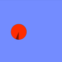

# Algodoo Stuff

This repository contains mechanism prototypes and other experiments made with Algodoo, such as a set of ragdoll characters with different superpowers.

## Scenes

This listing was generated with `python thumbs-to-markdown.py`

These files don't currently have thumbnails:

- [Push-Latch Counterweight v0.1](scenes/Push-Latch%20Counterweight%20v0.1.phz)
- [_ONEXITSAVE](scenes/_ONEXITSAVE.phz)
- [Winding Rope on Reals](scenes/Recovered%20From%20Harddrive%20Backup/Winding%20Rope%20on%20Reals.phz)
- [start of dynamic decal button thing 5](scenes/Recovered%20From%20Harddrive%20Backup/start%20of%20dynamic%20decal%20button%20thing%205.phz)
- [Radio Button WIP (shitty almost-latching)](scenes/Recovered%20From%20Harddrive%20Backup/Radio%20Button%20WIP%20%28shitty%20almost-latching%29.phz)
- [Winding Paper on Reals](scenes/Recovered%20From%20Harddrive%20Backup/Winding%20Paper%20on%20Reals.phz)
- [start of dynamic decal button thing 7](scenes/Recovered%20From%20Harddrive%20Backup/start%20of%20dynamic%20decal%20button%20thing%207.phz)
- [start of dynamic decal button thing 4](scenes/Recovered%20From%20Harddrive%20Backup/start%20of%20dynamic%20decal%20button%20thing%204.phz)
- [Shitty Ratchet Gear](scenes/Recovered%20From%20Harddrive%20Backup/Shitty%20Ratchet%20Gear.phz)
- [(start of dynamic decal button thing)](scenes/Recovered%20From%20Harddrive%20Backup/%28start%20of%20dynamic%20decal%20button%20thing%29.phz)
- [Winding Paper on Reals with Box](scenes/Recovered%20From%20Harddrive%20Backup/Winding%20Paper%20on%20Reals%20with%20Box.phz)
- [cement truck sketch](scenes/Recovered%20From%20Harddrive%20Backup/cement%20truck%20sketch.phz)
- [Mechanical Motion Adder start 3 (algodoo sucks)](scenes/Recovered%20From%20Harddrive%20Backup/Mechanical%20Motion%20Adder%20start%203%20%28algodoo%20sucks%29.phz)
- [Winding Paper on Reals with Box and shitty gears lul](scenes/Recovered%20From%20Harddrive%20Backup/Winding%20Paper%20on%20Reals%20with%20Box%20and%20shitty%20gears%20lul.phz)
- [start of dynamic decal button thing 9.4](scenes/Recovered%20From%20Harddrive%20Backup/start%20of%20dynamic%20decal%20button%20thing%209.4.phz)
- [start of dynamic decal button thing 6](scenes/Recovered%20From%20Harddrive%20Backup/start%20of%20dynamic%20decal%20button%20thing%206.phz)
- [Mechanical Motion Adder start (algodoo sucks)](scenes/Recovered%20From%20Harddrive%20Backup/Mechanical%20Motion%20Adder%20start%20%28algodoo%20sucks%29.phz)
- [(start of dynamic decal button thing 3)](scenes/Recovered%20From%20Harddrive%20Backup/%28start%20of%20dynamic%20decal%20button%20thing%203%29.phz)
- [Radio Button WIP](scenes/Recovered%20From%20Harddrive%20Backup/Radio%20Button%20WIP.phz)
- [Winding Paper on Reals with Box and custom Linear Gear and Scrollbar](scenes/Recovered%20From%20Harddrive%20Backup/Winding%20Paper%20on%20Reals%20with%20Box%20and%20custom%20Linear%20Gear%20and%20Scrollbar.phz)
- [start of dynamic decal button thing 9.3](scenes/Recovered%20From%20Harddrive%20Backup/start%20of%20dynamic%20decal%20button%20thing%209.3.phz)
- [_ONEXITSAVE](scenes/Recovered%20From%20Harddrive%20Backup/_ONEXITSAVE.phz)
- [cement truck sketch with wheelz](scenes/Recovered%20From%20Harddrive%20Backup/cement%20truck%20sketch%20with%20wheelz.phz)
- [Winding Paper on Reals with Box and custom Linear Gear r2.1](scenes/Recovered%20From%20Harddrive%20Backup/Winding%20Paper%20on%20Reals%20with%20Box%20and%20custom%20Linear%20Gear%20r2.1.phz)
- [(start of dynamic decal button thing 2)](scenes/Recovered%20From%20Harddrive%20Backup/%28start%20of%20dynamic%20decal%20button%20thing%202%29.phz)
- [Mechanical Motion Adder start 2 (algodoo sucks)](scenes/Recovered%20From%20Harddrive%20Backup/Mechanical%20Motion%20Adder%20start%202%20%28algodoo%20sucks%29.phz)
- [start of dynamic decal button thing 8](scenes/Recovered%20From%20Harddrive%20Backup/start%20of%20dynamic%20decal%20button%20thing%208.phz)
- [start of dynamic decal button thing 9 WIP (2)](scenes/Recovered%20From%20Harddrive%20Backup/start%20of%20dynamic%20decal%20button%20thing%209%20WIP%20%282%29.phz)
- [Winding Paper on Reals with Box and custom Linear Gear](scenes/Recovered%20From%20Harddrive%20Backup/Winding%20Paper%20on%20Reals%20with%20Box%20and%20custom%20Linear%20Gear.phz)
- [Winding Paper on Reals with Box and custom Linear Gear r2](scenes/Recovered%20From%20Harddrive%20Backup/Winding%20Paper%20on%20Reals%20with%20Box%20and%20custom%20Linear%20Gear%20r2.phz)
- [shitty sketch (trace) of a cement truck](scenes/Recovered%20From%20Harddrive%20Backup/shitty%20sketch%20%28trace%29%20of%20a%20cement%20truck.phz)
- [start of dynamic decal button thing 9 V](scenes/Recovered%20From%20Harddrive%20Backup/start%20of%20dynamic%20decal%20button%20thing%209%20V.phz)
- [start of dynamic decal button thing 9 WIP](scenes/Recovered%20From%20Harddrive%20Backup/start%20of%20dynamic%20decal%20button%20thing%209%20WIP.phz)
- [196414_](scenes/Recovered%20From%20Harddrive%20Backup/downloads/196414_.phz)
- [Scissor Mechanism](scenes/Paint%20IRL%20%28and%20maybe%20other%20things%29/Scissor%20Mechanism.phz)
- [WIP Bank Switches with sturdier sliding joints and horizontal bar movement 2](scenes/Paint%20IRL%20%28and%20maybe%20other%20things%29/WIP%20Bank%20Switches%20with%20sturdier%20sliding%20joints%20and%20horizontal%20bar%20movement%202.phz)
- [Springy latch button bank WIP 3 Recalled Edition (Explosive)](scenes/Paint%20IRL%20%28and%20maybe%20other%20things%29/Springy%20latch%20button%20bank%20WIP%203%20Recalled%20Edition%20%28Explosive%29.phz)
- [Triangle Latch and Horsehead Unlatch Button Bank](scenes/Paint%20IRL%20%28and%20maybe%20other%20things%29/Triangle%20Latch%20and%20Horsehead%20Unlatch%20Button%20Bank.phz)
- [Push-Push Button 1.5](scenes/Paint%20IRL%20%28and%20maybe%20other%20things%29/Push-Push%20Button%201.5.phz)
- [See-Saw Button](scenes/Paint%20IRL%20%28and%20maybe%20other%20things%29/See-Saw%20Button.phz)
- [Sliding Joint](scenes/Paint%20IRL%20%28and%20maybe%20other%20things%29/Sliding%20Joint.phz)
- [WIP Bank Switches with sturdier sliding joints](scenes/Paint%20IRL%20%28and%20maybe%20other%20things%29/WIP%20Bank%20Switches%20with%20sturdier%20sliding%20joints.phz)
- [Bank Switches 0.1 (really sad)](scenes/Paint%20IRL%20%28and%20maybe%20other%20things%29/Bank%20Switches%200.1%20%28really%20sad%29.phz)
- [Two Scissor Mechanisms For Colinear Reverse Reciprocal Motion Transmission](scenes/Paint%20IRL%20%28and%20maybe%20other%20things%29/Two%20Scissor%20Mechanisms%20For%20Colinear%20Reverse%20Reciprocal%20Motion%20Transmission.phz)
- [WIP Bank Switches with sturdier sliding joints and horizontal bar movement](scenes/Paint%20IRL%20%28and%20maybe%20other%20things%29/WIP%20Bank%20Switches%20with%20sturdier%20sliding%20joints%20and%20horizontal%20bar%20movement.phz)
- [Push-Push Button 1.8](scenes/Paint%20IRL%20%28and%20maybe%20other%20things%29/Push-Push%20Button%201.8.phz)
- [Springy latch button bank WIP](scenes/Paint%20IRL%20%28and%20maybe%20other%20things%29/Springy%20latch%20button%20bank%20WIP.phz)
- [Push-Push Button 1.3](scenes/Paint%20IRL%20%28and%20maybe%20other%20things%29/Push-Push%20Button%201.3.phz)
- [Push-Push Button 1.7](scenes/Paint%20IRL%20%28and%20maybe%20other%20things%29/Push-Push%20Button%201.7.phz)
- [Three Mechanisms For Colinear Reverse Reciprocal Motion Transmission](scenes/Paint%20IRL%20%28and%20maybe%20other%20things%29/Three%20Mechanisms%20For%20Colinear%20Reverse%20Reciprocal%20Motion%20Transmission.phz)
- [Springy-tipped latch button bank WIP 3 lasers are fun](scenes/Paint%20IRL%20%28and%20maybe%20other%20things%29/Springy-tipped%20latch%20button%20bank%20WIP%203%20lasers%20are%20fun.phz)
- [See-Saw vs. Gears](scenes/Paint%20IRL%20%28and%20maybe%20other%20things%29/See-Saw%20vs.%20Gears.phz)
- [Springy-tipped latch button bank WIP 4 maybe nothing new](scenes/Paint%20IRL%20%28and%20maybe%20other%20things%29/Springy-tipped%20latch%20button%20bank%20WIP%204%20maybe%20nothing%20new.phz)
- [3-button bank (BARELY works, needs gravity off)](scenes/Paint%20IRL%20%28and%20maybe%20other%20things%29/3-button%20bank%20%28BARELY%20works%2C%20needs%20gravity%20off%29.phz)
- [Springy-tipped latch button bank WIP 2](scenes/Paint%20IRL%20%28and%20maybe%20other%20things%29/Springy-tipped%20latch%20button%20bank%20WIP%202.phz)
- [Springy latch button bank WIP 4](scenes/Paint%20IRL%20%28and%20maybe%20other%20things%29/Springy%20latch%20button%20bank%20WIP%204.phz)
- [WIP See-Saw Button Bank 0.3](scenes/Paint%20IRL%20%28and%20maybe%20other%20things%29/WIP%20See-Saw%20Button%20Bank%200.3.phz)
- [Springy-tipped latch button bank](scenes/Paint%20IRL%20%28and%20maybe%20other%20things%29/Springy-tipped%20latch%20button%20bank.phz)
- [Scissor Mechanism For Colinear Reverse Reciprocal Motion Transmission](scenes/Paint%20IRL%20%28and%20maybe%20other%20things%29/Scissor%20Mechanism%20For%20Colinear%20Reverse%20Reciprocal%20Motion%20Transmission.phz)
- [WIP See-Saw Button Bank](scenes/Paint%20IRL%20%28and%20maybe%20other%20things%29/WIP%20See-Saw%20Button%20Bank.phz)
- [Shittily Linked Buttons](scenes/Paint%20IRL%20%28and%20maybe%20other%20things%29/Shittily%20Linked%20Buttons.phz)
- [No spongify - solid body is too flimsy - physics are too flimsy!](scenes/Paint%20IRL%20%28and%20maybe%20other%20things%29/No%20spongify%20-%20solid%20body%20is%20too%20flimsy%20-%20physics%20are%20too%20flimsy%21.phz)
- [Springy latch button bank WIP 2 Flintstones Edition](scenes/Paint%20IRL%20%28and%20maybe%20other%20things%29/Springy%20latch%20button%20bank%20WIP%202%20Flintstones%20Edition.phz)
- [latch button bank WIP 6 (kinda decent)](scenes/Paint%20IRL%20%28and%20maybe%20other%20things%29/latch%20button%20bank%20WIP%206%20%28kinda%20decent%29.phz)
- [Sliding Joint with Spring](scenes/Paint%20IRL%20%28and%20maybe%20other%20things%29/Sliding%20Joint%20with%20Spring.phz)
- [WIP See-Saw Button Bank 0.2](scenes/Paint%20IRL%20%28and%20maybe%20other%20things%29/WIP%20See-Saw%20Button%20Bank%200.2.phz)
- [Threeway ( ͡° ͜ʖ ͡°) Linear Gears](scenes/Paint%20IRL%20%28and%20maybe%20other%20things%29/Threeway%20%28%20%CD%A1%C2%B0%20%CD%9C%CA%96%20%CD%A1%C2%B0%29%20Linear%20Gears.phz)
- [WIP See-Saw Button Bank 0.4](scenes/Paint%20IRL%20%28and%20maybe%20other%20things%29/WIP%20See-Saw%20Button%20Bank%200.4.phz)
- [Linked Sliding Joints](scenes/Paint%20IRL%20%28and%20maybe%20other%20things%29/Linked%20Sliding%20Joints.phz)
- [Push-Push Button](scenes/Paint%20IRL%20%28and%20maybe%20other%20things%29/Push-Push%20Button.phz)
- [latch button bank WIP 5 (simpler, too dense off center of the shaft)](scenes/Paint%20IRL%20%28and%20maybe%20other%20things%29/latch%20button%20bank%20WIP%205%20%28simpler%2C%20too%20dense%20off%20center%20of%20the%20shaft%29.phz)
- [Push-Push Button (sort of Push-Pull rather)](scenes/Paint%20IRL%20%28and%20maybe%20other%20things%29/Push-Push%20Button%20%28sort%20of%20Push-Pull%20rather%29.phz)
- [Bank Switches 0](scenes/Paint%20IRL%20%28and%20maybe%20other%20things%29/Bank%20Switches%200.phz)
- [Push-Push Button 1.4 (lips style)](scenes/Paint%20IRL%20%28and%20maybe%20other%20things%29/Push-Push%20Button%201.4%20%28lips%20style%29.phz)
- [Two Scissor Mechanisms For Colinear Reverse Reciprocal Motion Transmission 2](scenes/Paint%20IRL%20%28and%20maybe%20other%20things%29/Two%20Scissor%20Mechanisms%20For%20Colinear%20Reverse%20Reciprocal%20Motion%20Transmission%202.phz)
- [Push-Push Button 1.6](scenes/Paint%20IRL%20%28and%20maybe%20other%20things%29/Push-Push%20Button%201.6.phz)
- [Spongify - soft body is too flimsy](scenes/Paint%20IRL%20%28and%20maybe%20other%20things%29/Spongify%20-%20soft%20body%20is%20too%20flimsy.phz)
- [Push-Push Button 1.2](scenes/Paint%20IRL%20%28and%20maybe%20other%20things%29/Push-Push%20Button%201.2.phz)
